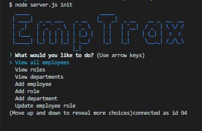
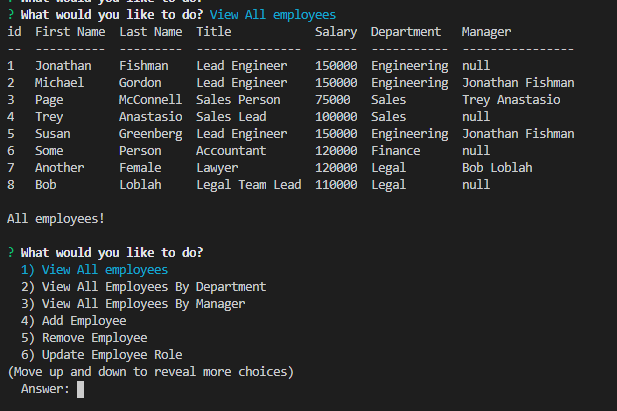

# Employee Tracker

## Description
Developers are often tasked with creating interfaces that make it easy for non-developers to view and interact with information stored in databases. Often these interfaces are known as **C**ontent **M**anagement **S**ystems. In this homework assignment, my challenge was to architect and build a solution for managing a company's employees using node, inquirer, and MySQL.

## Initialization:

```
node server.js init

```







## Acceptance Criteria

```
As a business owner
I want to be able to view and manage the departments, roles, and employees in my company
So that I can organize and plan my business
```

## Technologies

*  MySql 

*  Inquirer.js 

*  Console.Table 

*  Commander 

*  Chalk 

*  Figlet

============================================================

## Status:

Like several other homework adssignments, this is a work in progress. I spent so much time trying to understand MySql, the overall execution of this app is a bit sloppy. I would like to revisit and incorporate separate files as well as the use of Constructors.

## Submission on BCS

You are required to submit the following:

[GitHub Repo](https://github.com/sdemercurio/employee-tracker.git)


